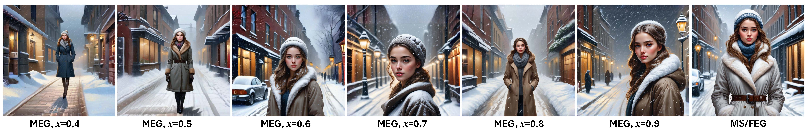

# MEGSplitting

This code repository includes an implementation demo of the collaborative generation pipeline developed in our manuscript. The novel concept of generation splitting is introduced in [[Slides]](./Optimal%20Energy-Delay%20Tradeoff%20for%20MEG.pdf) of our conference paper presented in ICC 2025. Manuscript of the according journal paper is under review and will be available soon.  

## Reproduce generated results
> 1. Download pretrained Restormer model from [here](https://drive.google.com/drive/folders/1bRBG8DG_72AGA6-eRePvChlT5ZO4cwJ4?usp=sharing), and put "single_image_defocus_deblurring.pth" in [this folder](./Restormer/Defocus_Deblurring/pretrained_models)
> 2. Run [MEG_inference.py](./MEG_inference.py) to reproduce the generated results.
> 3. Run [FID_SSIM_eval.py](./FID_SSIM_eval.py) to evaluate the generated results.

## Test different models 
In script [MEG_inference.py](./MEG_inference.py), line 19, you may choose [Stable Diffusion 3-medium](https://huggingface.co/stabilityai/stable-diffusion-3-medium) as the ES model by setting ES_MODEL = 'SD3'. 
>  *You may need to apply for a [huggingface user access token](https://huggingface.co/docs/hub/security-tokens) to use this model*
> 
>  *Put your user access token in script [MEG_inference.py](./MEG_inference.py), line 20.*

## Test different generation modes
We provide two generation modes in this implementation demo. 
> To test the first generation mode (for generation quality comparison in our paper), set `TEST_MODE = 0` in [MEG_inference.py](./MEG_inference.py), line 18.
> 
> To test the second genration mode (for actual deployment), set `TEST_MODE = 1` in [MEG_inference.py](./MEG_inference.py), line 18.

## Generated Results
- **Sample results 1.** Edge LGM using SDXL, Mode 1.

- **Sample results 2.** Edge LGM using SD3-Medium, Mode 1.

- **Sample results 3.** Edge LGM using SDXL, Mode 2.

